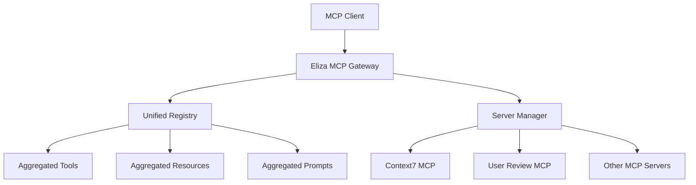

# Eliza MCP Gateway

An MCP (Model Context Protocol) gateway that connects multiple MCP servers into a unified interface, providing seamless access to diverse MCP capabilities through a single connection.

## 🚀 Features

- **🔄 Multi-Server Gateway**: Connect to multiple MCP servers simultaneously
- **🏷️ Namespace Support**: Automatic namespacing to prevent tool/resource conflicts
- **📋 Configuration-Based**: YAML/JSON configuration files for easy server management
- **💪 Health Monitoring**: Automatic health checks and connection management
- **🛡️ Conflict Resolution**: Built-in conflict resolution for tools, resources, and prompts
- **⚡ Real-time Updates**: Dynamic capability discovery and registry updates
- **🚀 Multi-Transport Support**: STDIO, HTTP, SSE, and WebSocket transports
- **💰 Paywall Enforcement**: Inbound payment enforcement with per-item pricing
- **🔐 x402 Integration**: Support for x402 payment protocol and outbound payments

## 📦 Installation

```bash
npm install -g @elizaos/mcp-gateway
```

Or run directly with npx:
```bash
npx @elizaos/mcp-gateway --config=config.yaml
```

## 🔧 Configuration

### Example YAML Configuration

```yaml
name: "Development MCP Gateway"
version: "1.0.0"
description: "Gateway connecting Context7 docs and User Review MCP for development workflow"

servers:
  # Context7 MCP Server - Up-to-date code documentation
  - name: "context7"
    command: "npx"
    args: ["-y", "@upstash/context7-mcp", "--api-key", "YOUR_API_KEY"]
    namespace: "docs"
    enabled: true
    timeout: 30000
    retryAttempts: 3

  # User Review MCP - Development feedback
  - name: "user-review"
    command: "npx"
    args: ["-y", "user-review-mcp"]
    namespace: "review"
    enabled: true

settings:
  enableToolConflictResolution: true
  enableResourceConflictResolution: true
  enablePromptConflictResolution: true
  logLevel: "info"
  maxConcurrentConnections: 10
  healthCheckInterval: 60000
```

### Example JSON Configuration

```json
{
  "name": "Development MCP Gateway",
  "servers": [
    {
      "name": "context7",
      "command": "npx",
      "args": ["-y", "@upstash/context7-mcp", "--api-key", "YOUR_API_KEY"],
      "namespace": "docs",
      "enabled": true
    },
    {
      "name": "user-review", 
      "command": "npx",
      "args": ["-y", "user-review-mcp"],
      "namespace": "review",
      "enabled": true
    }
  ],
  "settings": {
    "enableToolConflictResolution": true,
    "logLevel": "info"
  }
}
```

## 🎯 Usage

### Command Line

```bash
# Using configuration file
mcp-gateway --config=config.yaml

# Using environment variables
MCP_SERVERS="context7:npx:@upstash/context7-mcp;user-review:npx:user-review-mcp" mcp-gateway
```

### Claude Desktop Configuration

Add to your Claude Desktop config (`~/Library/Application Support/Claude/claude_desktop_config.json`):

```json
{
  "mcpServers": {
    "eliza-gateway": {
      "command": "npx",
      "args": ["-y", "mcp-gateway", "--config", "/path/to/your/config.yaml"]
    }
  }
}
```

### Environment Variables

- `MCP_GATEWAY_NAME` - Name of the gateway (default: "Eliza MCP Gateway")
- `MCP_LOG_LEVEL` - Log level: error, warn, info, debug (default: info)
- `MCP_SERVERS` - Semicolon-separated server specs (name:command:args)
- `MCP_ENABLE_TOOL_CONFLICT_RESOLUTION` - Enable conflict resolution (default: true)

## 🚀 Transport Support

### **Fully Supported Transports:**

- **📟 STDIO Transport** - Local MCP servers via stdin/stdout
  - Perfect for command-line MCP servers, Claude Desktop, Cursor
  - Configuration: `command`, `args`, `env`, `cwd`

- **🌐 HTTP Transport** - Remote MCP servers via HTTP/HTTPS
  - For web-based MCP servers and API integrations
  - Configuration: `url`, `apiKey`, `headers`

- **📡 SSE Transport** - Server-Sent Events for streaming
  - Real-time streaming capabilities
  - Configuration: `sseUrl`, `postUrl`, `apiKey`, `headers`

- **🔌 WebSocket Transport** - Real-time bidirectional communication
  - Low-latency, persistent connections
  - Configuration: `url`, `apiKey`, `headers`

```yaml
# Modern transport configuration
servers:
  # Local STDIO server
  - name: "local-server"
    transport:
      type: "stdio"
      command: "npx"
      args: ["-y", "user-review-mcp"]
    
  # Remote HTTP server
  - name: "remote-server"
    transport:
      type: "http"
      url: "https://mcp.example.com/api"
      apiKey: "YOUR_API_KEY"
    
  # Legacy format (still supported)
  - name: "legacy-server"
    command: "npx"
    args: ["-y", "@upstash/context7-mcp"]
```

### **Working Examples:**

See the `examples/` directory for complete, tested configurations:
- [`examples/mixed-transports.yaml`](examples/mixed-transports.yaml) - STDIO + HTTP combination
- [`examples/http-remote.yaml`](examples/http-remote.yaml) - Pure HTTP setup
- [`examples/future-multi-transport.yaml`](examples/future-multi-transport.yaml) - All 4 transport types
- [`examples/config.yaml`](examples/config.yaml) - Basic STDIO configuration

## 🧪 Testing

The gateway includes a comprehensive End-to-End test suite that validates all functionality across different configurations and transport types.

### Quick Testing (Recommended)
```bash
# Run essential tests (fastest)
npm run test:quick

# Or use the test runner script
./tests/test-runner.sh quick
```

### Full Test Suite
```bash
# Run comprehensive tests including MCP client communication
npm run test

# Or use the test runner script  
./tests/test-runner.sh full
```

### Test Specific Configurations
```bash
# Test a specific configuration file
./tests/test-runner.sh config basic.yaml
./tests/test-runner.sh config multi-server.yaml

# Available test configs:
# - basic.yaml - Single server, STDIO transport
# - basic.json - Same as basic.yaml but JSON format  
# - namespaced.yaml - Single server with namespace
# - multi-server.yaml - Multiple servers, different namespaces
# - invalid.yaml - Invalid config for error testing
# - failing-server.yaml - Server connection failure testing
```

### Interactive Testing
```bash
# Use MCP Inspector for interactive testing
./tests/test-runner.sh manual
./tests/test-runner.sh manual multi-server.yaml

# Manual testing with specific config
npx @modelcontextprotocol/inspector node build/index.js --config=examples/mixed-transports.yaml
```

### Test Coverage
The E2E test suite validates:
- ✅ **Configuration Loading**: YAML, JSON, and environment variables
- ✅ **All Transport Types**: STDIO, HTTP, SSE, WebSocket
- ✅ **Multi-Server Support**: Multiple servers with namespace handling
- ✅ **Error Handling**: Invalid configs, connection failures, graceful degradation
- ✅ **Tool Execution**: MCP protocol communication and tool calls
- ✅ **Process Management**: Startup, shutdown, cleanup

### CI/CD Integration
```bash
# For continuous integration pipelines
npm run test:quick  # Fast, essential tests only
npm run test        # Full test suite (slower but comprehensive)
```

## 🔐 Environment Variables

When using x402 payment middleware or certain MCP servers, you'll need to set environment variables:

```bash
# Copy the example environment file
cp env.example .env

# Edit .env and add your keys:
# - CONTEXT7_API_KEY: Get from https://context7.com/dashboard
# - X402_EVM_PRIVATE_KEY: Your EVM wallet private key for payments
# - X402_TEST_PRIVATE_KEY: Test wallet key (for testing only)
# - TEST_PRIVATE_KEY: Additional test key for unit tests
```

**Security Notes:**
- Never commit `.env` files or actual private keys to version control
- Use environment variables or secure key management systems in production
- For testing, generate test-only keys that don't hold real funds

## 💰 Paywall Enforcement

The MCP Gateway supports inbound paywall enforcement, allowing you to "paywall any server" regardless of the upstream server's transport. This feature enables per-request payment before the gateway forwards calls to upstream MCP servers.

### Key Features

- **Per-Server Enforcement**: Enable paywall for specific servers while keeping others free
- **Granular Pricing**: Set different prices for tools, resources, and prompts
- **Multiple Networks**: Support for Base and Base Sepolia networks
- **Session Management**: Track authorized payments and balances per client session
- **Policy Control**: Configure free listing vs. paid calls
- **Special Tools**: Built-in tools for pricing discovery and payment authorization

### Paywall Configuration

Add a `paywall` section to any server configuration:

```yaml
servers:
  premium-ai:
    enabled: true
    transport:
      type: http
      url: "https://api.premium-ai.com/mcp"
    paywall:
      enabled: true
      wallet:
        type: evm
        network: base-sepolia
        privateKeyEnv: PREMIUM_AI_WALLET_KEY
      maxValueMicroUSDC: "500000"  # 0.50 USDC max per request
      pricing:
        defaultPriceMicroUSDC: "10000"  # 0.01 USDC default
        perTool:
          gpt4-analysis: "50000"      # 0.05 USDC
          image-generation: "25000"   # 0.025 USDC
          simple-query: "5000"        # 0.005 USDC
        perResource:
          "model://gpt-4": "100000"   # 0.10 USDC
          "data://premium": "20000"   # 0.02 USDC
        perPrompt:
          expert-prompt: "15000"      # 0.015 USDC
      policy:
        freeList: true          # Allow listing tools/resources for free
        requireForCalls: true   # Require payment for actual calls
```

### Pricing Resolution

The gateway resolves pricing in the following order:
1. **Per-item pricing** (tool/resource/prompt specific)
2. **Default pricing** (if no specific price is set)
3. **Free** (if no pricing is configured)

### Environment Variables

Set the private key for each paywall-enabled server:

```bash
# For the example above
PREMIUM_AI_WALLET_KEY=0x1234567890abcdef...

# Or use a shared key for multiple servers
PAYWALL_PRIVATE_KEY=0x1234567890abcdef...
```

### Client Experience

#### Unauthorized Calls

When a client tries to call a paid tool without authorization, they receive an MCP error with payment instructions:

```json
{
  "error": {
    "code": -32603,
    "message": "Payment required for tool 'gpt4-analysis': 50000 micro-USDC",
    "data": {
      "paymentRequired": true,
      "kind": "tool",
      "id": "gpt4-analysis",
      "amountMicroUSDC": "50000",
      "network": "base-sepolia",
      "token": "USDC",
      "recipient": "0x...",
      "nonce": "1640995200000",
      "howToPay": "https://docs.x402.org/how-to-pay",
      "instructions": "This tool requires payment of 50000 micro-USDC ($0.050000). Use the 'gateway:paywall:authorize' tool with an x402 payment.",
      "paywallTools": [
        "gateway:paywall:get-pricing - Get pricing information",
        "gateway:paywall:authorize - Authorize payment with x402 payment"
      ]
    }
  }
}
```

#### Special Paywall Tools

The gateway automatically adds special tools when paywall is enabled:

1. **`gateway:paywall:get-pricing`**: Returns pricing information for all paywall-enabled servers
2. **`gateway:paywall:authorize`**: Accepts x402 payment to authorize future calls

#### Payment Flow

1. **Discovery**: Call `gateway:paywall:get-pricing` to see what costs what
2. **Payment**: Use `gateway:paywall:authorize` with x402 payment data
3. **Usage**: Make calls to paid tools/resources/prompts until balance is exhausted

Example authorization:

```javascript
// Call the authorize tool with x402 payment
await client.callTool({
  name: 'gateway:paywall:authorize',
  arguments: {
    xPayment: 'x402-payment-envelope-here'
  }
});

// Now you can call paid tools
await client.callTool({
  name: 'gpt4-analysis',
  arguments: { query: 'Analyze this data...' }
});
```

### HTTP/SSE Frontend (Optional)

For HTTP-based clients, the gateway can expose REST endpoints:

- **POST /pay**: Accept x402 payments and issue session tokens
- **GET /pricing**: Return pricing information
- **GET /health**: Gateway and paywall status
- **POST /mcp/\***: MCP calls over HTTP (with proper authorization)

HTTP clients receive standard 402 Payment Required responses with `X-Payment-Required` headers.

### Testing Paywall

Run paywall tests:

```bash
# Unit tests for paywall logic
npm run test:paywall:unit

# E2E tests for paywall flows  
npm run test:paywall:e2e

# Test with basic paywall config
npm run test:paywall:basic

# Test with advanced multi-server config
npm run test:paywall:advanced
```

### Security Considerations

- **Private Keys**: Store wallet private keys securely, never in code
- **Network Choice**: Use testnets for development, mainnet for production
- **Amount Limits**: Set reasonable `maxValueMicroUSDC` limits
- **Session Expiry**: Sessions expire after 24 hours by default
- **Payment Verification**: Production deployments should use robust x402 verification

## 📊 Example Output

When running with multiple servers, you'll see:

```
[INFO] Starting Eliza MCP Gateway Server: Development MCP Gateway v1.0.0
[INFO] Initializing 2 servers...
[INFO] Successfully initialized server context7
[INFO] Successfully initialized server user-review  
[INFO] Initialized 2/2 servers successfully
[INFO] Registry refreshed: 3 tools, 0 resources, 0 prompts
[INFO] === Eliza MCP Gateway Status ===
[INFO] Server Connections: 2/2 active
[INFO] Tools by Server:
[INFO]   - context7: 2 tools
[INFO]   - user-review: 1 tools
```

Available tools with namespacing:
- `docs:resolve-library-id` (Context7)
- `docs:get-library-docs` (Context7) 
- `review:get-user-review` (User Review MCP)

## 🏗️ Architecture



## 🤝 Contributing

1. Fork the repository
2. Create a feature branch
3. Make your changes
4. Add tests
5. Submit a pull request

## 📄 License

MIT License - see LICENSE file for details.

## 🙏 Acknowledgments

- Built with the [Model Context Protocol](https://modelcontextprotocol.io)
- Tested with [Context7 MCP Server](https://github.com/upstash/context7)
- Tested with [User Review MCP](https://www.npmjs.com/package/user-review-mcp)
