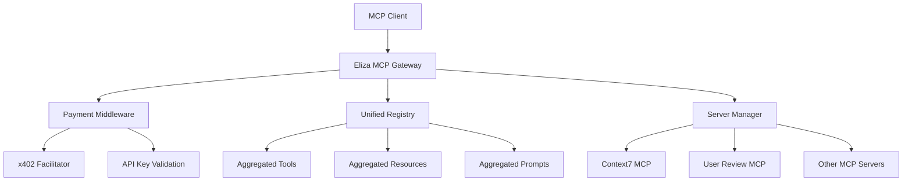

# Eliza MCP Gateway

An MCP (Model Context Protocol) gateway that connects multiple MCP servers into a unified interface, providing seamless access to diverse MCP capabilities through a single connection.

## 🚀 Features

- **🔄 Multi-Server Gateway**: Connect to multiple MCP servers simultaneously
- **🏷️ Namespace Support**: Automatic namespacing to prevent tool/resource conflicts
- **💰 Payment Gating**: Monetize tools with x402 blockchain payments & API keys
- **📋 Configuration-Based**: YAML/JSON configuration files for easy server management
- **💪 Health Monitoring**: Automatic health checks and connection management
- **🛡️ Conflict Resolution**: Built-in conflict resolution for tools, resources, and prompts
- **⚡ Real-time Updates**: Dynamic capability discovery and registry updates
- **🚀 Multi-Transport Support**: STDIO, HTTP, SSE, and WebSocket transports

## 📦 Installation

```bash
npm install -g @elizaos/mcp-gateway
```

Or run directly with npx:
```bash
npx @elizaos/mcp-gateway --config=config.yaml
```

## 🔧 Configuration

### Example YAML Configuration

```yaml
name: "Development MCP Gateway"
version: "1.0.0"
description: "Gateway connecting Context7 docs and User Review MCP for development workflow"

servers:
  # Context7 MCP Server - Up-to-date code documentation
  - name: "context7"
    command: "npx"
    args: ["-y", "@upstash/context7-mcp", "--api-key", "YOUR_API_KEY"]
    namespace: "docs"
    enabled: true
    timeout: 30000
    retryAttempts: 3

  # User Review MCP - Development feedback
  - name: "user-review"
    command: "npx"
    args: ["-y", "user-review-mcp"]
    namespace: "review"
    enabled: true

settings:
  enableToolConflictResolution: true
  enableResourceConflictResolution: true
  enablePromptConflictResolution: true
  logLevel: "info"
  maxConcurrentConnections: 10
  healthCheckInterval: 60000
```

### Example JSON Configuration

```json
{
  "name": "Development MCP Gateway",
  "servers": [
    {
      "name": "context7",
      "command": "npx",
      "args": ["-y", "@upstash/context7-mcp", "--api-key", "YOUR_API_KEY"],
      "namespace": "docs",
      "enabled": true
    },
    {
      "name": "user-review", 
      "command": "npx",
      "args": ["-y", "user-review-mcp"],
      "namespace": "review",
      "enabled": true
    }
  ],
  "settings": {
    "enableToolConflictResolution": true,
    "logLevel": "info"
  }
}
```

## 🎯 Usage

### Command Line

```bash
# Using configuration file
mcp-gateway --config=config.yaml

# Using environment variables
MCP_SERVERS="context7:npx:@upstash/context7-mcp;user-review:npx:user-review-mcp" mcp-gateway
```

### Claude Desktop Configuration

Add to your Claude Desktop config (`~/Library/Application Support/Claude/claude_desktop_config.json`):

```json
{
  "mcpServers": {
    "eliza-gateway": {
      "command": "npx",
      "args": ["-y", "mcp-gateway", "--config", "/path/to/your/config.yaml"]
    }
  }
}
```

### Environment Variables

- `MCP_GATEWAY_NAME` - Name of the gateway (default: "Eliza MCP Gateway")
- `MCP_LOG_LEVEL` - Log level: error, warn, info, debug (default: info)
- `MCP_SERVERS` - Semicolon-separated server specs (name:command:args)
- `MCP_ENABLE_TOOL_CONFLICT_RESOLUTION` - Enable conflict resolution (default: true)

## 🚀 Transport Support

### **Fully Supported Transports:**

- **📟 STDIO Transport** - Local MCP servers via stdin/stdout
  - Perfect for command-line MCP servers, Claude Desktop, Cursor
  - Configuration: `command`, `args`, `env`, `cwd`

- **🌐 HTTP Transport** - Remote MCP servers via HTTP/HTTPS
  - For web-based MCP servers and API integrations
  - Configuration: `url`, `apiKey`, `headers`

- **📡 SSE Transport** - Server-Sent Events for streaming
  - Real-time streaming capabilities
  - Configuration: `sseUrl`, `postUrl`, `apiKey`, `headers`

- **🔌 WebSocket Transport** - Real-time bidirectional communication
  - Low-latency, persistent connections
  - Configuration: `url`, `apiKey`, `headers`

```yaml
# Modern transport configuration
servers:
  # Local STDIO server
  - name: "local-server"
    transport:
      type: "stdio"
      command: "npx"
      args: ["-y", "user-review-mcp"]
    
  # Remote HTTP server
  - name: "remote-server"
    transport:
      type: "http"
      url: "https://mcp.example.com/api"
      apiKey: "YOUR_API_KEY"
    
  # Legacy format (still supported)
  - name: "legacy-server"
    command: "npx"
    args: ["-y", "@upstash/context7-mcp"]
```

### **Working Examples:**

See the `examples/` directory for complete, tested configurations:
- [`examples/mixed-transports.yaml`](examples/mixed-transports.yaml) - STDIO + HTTP combination
- [`examples/http-remote.yaml`](examples/http-remote.yaml) - Pure HTTP setup
- [`examples/future-multi-transport.yaml`](examples/future-multi-transport.yaml) - All 4 transport types
- [`examples/config.yaml`](examples/config.yaml) - Basic STDIO configuration

## 🧪 Testing

The gateway includes a comprehensive End-to-End test suite that validates all functionality across different configurations and transport types.

### Quick Testing (Recommended)
```bash
# Run essential tests (fastest)
bun run test:quick
```

### Full Test Suite
```bash
# Run all tests including payment tests
bun run test:all

# Or run test suites individually:
bun run test:quick   # Quick smoke tests (~45s)
bun run test         # Full E2E tests (~180s)
bun run test:payment # Payment E2E tests (~31s)
```

### Test Specific Configurations
```bash
# Test with specific config
bun run start --config=tests/configs/basic.yaml

# Available test configs:
# Core functionality:
# - basic.yaml - Single server, STDIO transport
# - basic.json - Same as basic.yaml but JSON format
# - namespaced.yaml - Single server with namespace
# - multi-server.yaml - Multiple servers, different namespaces
# - invalid.yaml - Invalid config for error testing
# - failing-server.yaml - Server connection failure testing
#
# Payment features:
# - paid-free-tools.yaml - Mix of free and paid tools
# - paid-api-key-only.yaml - API key authentication only
# - paid-x402-only.yaml - x402 blockchain payments only
# - paid-default-pricing.yaml - Server-wide default pricing
# - paid-disabled.yaml - Payment disabled (backward compatibility)
```

### Interactive Testing
```bash
# Manual testing with MCP Inspector
npx @modelcontextprotocol/inspector bun run src/index.ts --config=examples/config.yaml
```

### Test Coverage
The E2E test suite validates:
- ✅ **Configuration Loading**: YAML, JSON, and environment variables
- ✅ **All Transport Types**: STDIO, HTTP, SSE, WebSocket
- ✅ **Multi-Server Support**: Multiple servers with namespace handling
- ✅ **Payment Features**: x402 verification, API keys, tiered pricing
- ✅ **Error Handling**: Invalid configs, connection failures, graceful degradation
- ✅ **Tool Execution**: MCP protocol communication and tool calls
- ✅ **Process Management**: Startup, shutdown, cleanup

**Latest Test Results:**
- Quick E2E: ✅ 11/11 passed (45s)
- Full E2E: ✅ 28/28 passed (180s)
- Payment E2E: ✅ 15/15 passed (31s)
- **Total: ✅ 54/54 tests (100% success rate)**

### CI/CD Integration
```bash
# For continuous integration pipelines
bun run test:quick  # Fast, essential tests only
bun run test:all    # Complete test suite
```

See [TESTING.md](TESTING.md) for detailed testing guide.

## 📊 Example Output

When running with multiple servers, you'll see:

```
[INFO] Starting Eliza MCP Gateway Server: Development MCP Gateway v1.0.0
[INFO] Initializing 2 servers...
[INFO] Successfully initialized server context7
[INFO] Successfully initialized server user-review  
[INFO] Initialized 2/2 servers successfully
[INFO] Registry refreshed: 3 tools, 0 resources, 0 prompts
[INFO] === Eliza MCP Gateway Status ===
[INFO] Server Connections: 2/2 active
[INFO] Tools by Server:
[INFO]   - context7: 2 tools
[INFO]   - user-review: 1 tools
```

Available tools with namespacing:
- `docs:resolve-library-id` (Context7)
- `docs:get-library-docs` (Context7) 
- `review:get-user-review` (User Review MCP)

## 💰 Payment Gating & Monetization

The gateway supports **payment-gated tools** to monetize your MCP services using:
- **x402 Protocol**: Blockchain-based micropayments (gasless, instant, no minimum)
- **ELIZA API Keys**: Traditional API key authentication with tiered pricing

### Payment Configuration

```yaml
payment:
  enabled: true
  recipient: "0xYourEthereumAddress"    # Where payments are sent
  network: "base-sepolia"                # base (mainnet) or base-sepolia (testnet)
  facilitator: "https://x402.org/facilitator"

  apiKeys:
    - key: "eliza_premium_abc123"
      tier: "premium"
      rateLimit: 10000
    - key: "eliza_basic_xyz789"
      tier: "basic"
      rateLimit: 100

servers:
  - name: "context7"
    command: "npx"
    args: ["-y", "@upstash/context7-mcp"]
    namespace: "docs"

    # Per-tool pricing
    tools:
      - name: "resolve-library-id"
        pricing:
          free: true

      - name: "get-library-docs"
        pricing:
          x402: "$0.01"           # x402 payment required
          apiKeyTiers:
            basic: "$0.005"       # 50% discount for basic tier
            premium: "free"        # Free for premium tier
```

### How It Works

**1. Free Access (No Payment)**
```yaml
tools:
  - name: "my-tool"
    pricing:
      free: true
```

**2. x402 Blockchain Payments**
- Client sends payment proof in `X-PAYMENT` header
- Gateway verifies payment with x402 facilitator
- Instant, gasless, $0.001 minimum payment
- No account or credit card needed

**3. API Key Authentication**
```bash
# Client sends API key
curl -H "X-ELIZA-API-KEY: eliza_premium_abc123" \
  http://gateway/mcp/tool
```

**4. Tiered Pricing**
```yaml
pricing:
  x402: "$0.10"              # Default price
  apiKeyTiers:
    basic: "$0.05"           # 50% off for basic
    premium: "free"          # Free for premium
```

### Client Integration

**Using x402 (Blockchain Payments):**
```typescript
import { privateKeyToAccount } from 'viem/accounts';
import { withPaymentInterceptor } from 'x402-axios';

const account = privateKeyToAccount('0xYourPrivateKey');
const client = withPaymentInterceptor(axios.create(), account);

// Payments happen automatically on 402 responses
await client.post('/mcp/tool', { args: {} });
```

**Using API Keys:**
```bash
# In Claude Desktop config
{
  "mcpServers": {
    "paid-gateway": {
      "command": "npx",
      "args": ["-y", "mcp-gateway", "--config", "paid-config.yaml"],
      "env": {
        "ELIZA_API_KEY": "eliza_premium_abc123"
      }
    }
  }
}
```

### Revenue Model Examples

**Example 1: Freemium Model**
```yaml
tools:
  - name: "basic-search"
    pricing:
      free: true
  - name: "advanced-search"
    pricing:
      x402: "$0.05"
      apiKeyTiers:
        premium: "free"
```

**Example 2: Pay-Per-Use**
```yaml
defaultPricing:
  x402: "$0.01"  # All tools cost $0.01 per call
```

**Example 3: Subscription via API Keys**
```yaml
apiKeys:
  - key: "monthly_subscriber_key"
    tier: "subscriber"
defaultPricing:
  apiKeyTiers:
    subscriber: "free"  # Subscribers get everything free
```

### Testing Payments

**1. Testnet (Free Testing):**
```yaml
payment:
  network: "base-sepolia"
  recipient: "0xYourTestAddress"
```
Get free testnet USDC from [Base Sepolia Faucet](https://www.coinbase.com/faucets/base-sepolia-faucet)

**2. Example Configs:**
- [`examples/paid-config.yaml`](examples/paid-config.yaml) - Full payment setup
- [`examples/paid-config.json`](examples/paid-config.json) - JSON format

**3. Run with Payment:**
```bash
bun run start --config=examples/paid-config.yaml
```

### Learn More

- **x402 Protocol**: https://developers.cloudflare.com/agents/x402/
- **x402 GitHub**: https://github.com/coinbase/x402
- **MCP Specification**: https://modelcontextprotocol.io

## 🏗️ Architecture



## 🤝 Contributing

1. Fork the repository
2. Create a feature branch
3. Make your changes
4. Add tests
5. Submit a pull request

## 📄 License

MIT License - see LICENSE file for details.

## 🙏 Acknowledgments

- Built with the [Model Context Protocol](https://modelcontextprotocol.io)
- Tested with [Context7 MCP Server](https://github.com/upstash/context7)
- Tested with [User Review MCP](https://www.npmjs.com/package/user-review-mcp)
